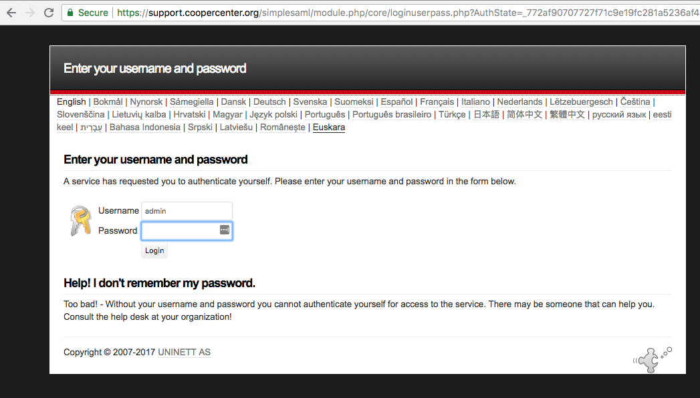
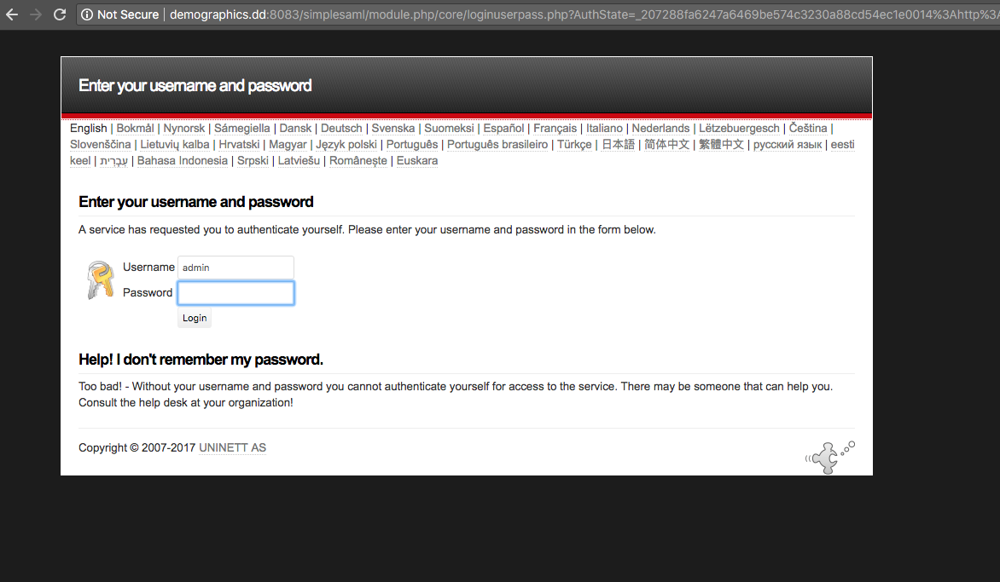
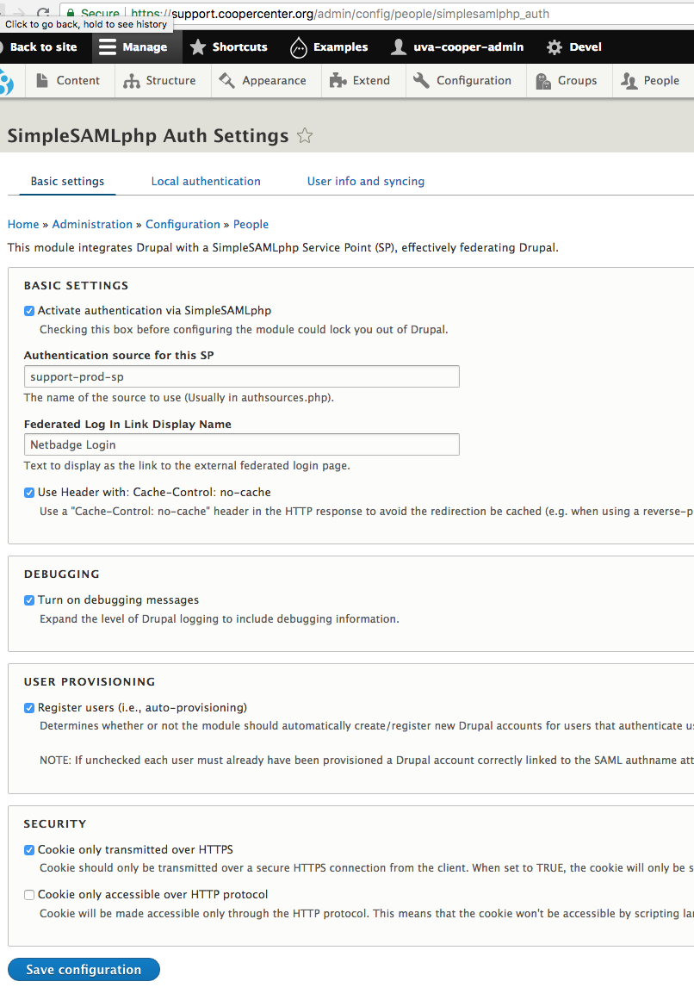
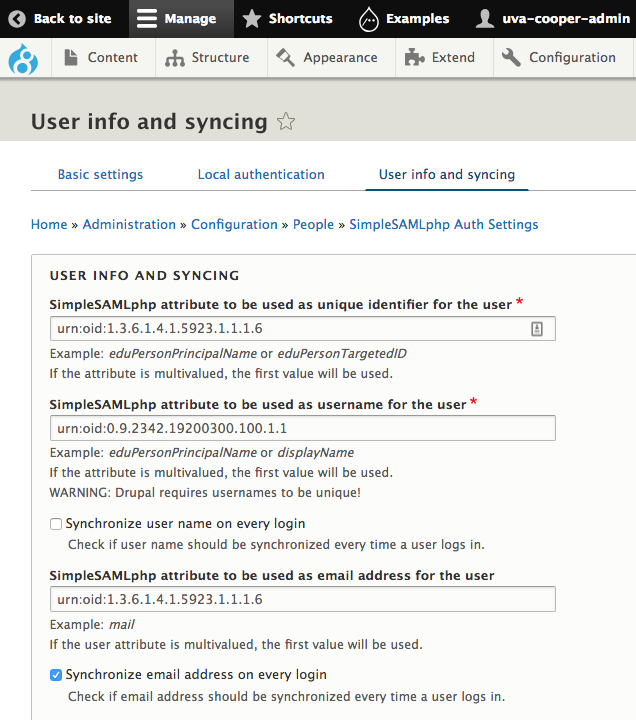

# Setting Up Netbadge SSO with Acquia Cloud Environments

[UVA provides this tutorial](http://its.virginia.edu/netbadge/unixdevelopers.html) about how to setup Shibboleth software on a website. However, Acquia Cloud doesn't support shibboleth software for their instances since they don't allow access to their Apache instances. I need to find a way to enable SSO using SimpleSAML.

[This Acquia Cloud  Tutorial](https://docs.acquia.com/en/stable/resource/using-simplesamlphp-acquia-cloud-site/) has an overview of the process for setting up SSO. Below are the steps I actually tried:

Mary Beth directed me to [another walkthrough](http://valuebound.com/resources/blog/how-to-configure-single-sign-on-across-multiple-drupal-8-platforms-or-websites) that describes getting Simplesamlphp to work with Drupal 8.

# Overview of process

1. Get a SSL certificate
2. Install the PHP code
3. Configure the code and setup your Service Provider (SP)
3. Install the simplesamlphp_auth module
4. Configure the simplesamlphp_auth module to talk with your IDP

## Getting a SSL certificate
SSL is required! You must use the https:// URL because simplesaml will not work without it. You can't securely authenticate if you can't securely connect. Getting  SSL certificate is easy. Simply make the request on the acquia enterprise account under the SSL tab. They'll give you a key which you send to your SSL provider. In our case, this is UVA service now. They send you back a bunch of certificates and you copy the certificates to Acquia through the same page you got the key to make your request. In the top box put the X509 Certificate only, Base64 encoded. In the intermediaries box put the X509 Intermediates/root only Reverse, Base64 encoded certificate. This is a standard certificate, not a legacy one. Now back to the actual simplesaml work.

## Installing the PHP code - SimpleSAMLphp configuration:

1. Download the SimpleSAMLphp library
2. Put the library next to the docroot folder
3. Make a symbolic link to the www folder of the simplesaml library so it is visible to the webserver. You don't want the other files visible on the web.
```
cd docroot; ln -s ../simplesamlphp/www simplesaml
```
4. You need to generate certificates in the cert folder inside the outer simplesamlphp-1.14.8 folder (not visible to the web) as (DRUPAL_ROOT/simplesamlphp-1.14.8/cert). You may need to create the cert folder. The generated key and cert are how the SP you make and your IDP talk to eachother. This cert has nothing to do with your SSL cert for the site.
```
openssl req -new -x509 -days 3652 -nodes -out saml.crt -keyout saml.pem
```

At this point you should be able to see the simplesaml admin login by adding `/simplesaml` to the end of your base domain.


## Configuring the SimpleSAMLphp library

### Editing config/config.php

In addition to some basic settings, you need to set where the information about authenticated users will be stored. It goes into the netbadge database that you created on Acquia Cloud. Set a $sqldsn , $sqlusername, and $sqlpassword for each of the possible environments. If you aren't storing the user's info in a database, you need to find an alternative place to store the info.

- baseurlpath
- certdir
- showerrors => true
- errorreporting => true
(These previous two need to be false in a live enviroment after this is all set up)
- auth.adminpassword
- secretsalt
- technicalcontact_name
- database.dsn => '$sqldsn'  <-- This was set outside of config array in previous bullet
- database.username => $sqlusername
- database.password => $sqlpassword

Here's some of the variables in the config array:

```php    
'certdir' => 'cert/',
'loggingdir' => 'log/',
'datadir' => 'data/',
```

Database credentials added to `my.config.php`

```php
if (isset($_ENV['AH_SITE_ENVIRONMENT'])) {
    switch ($_ENV['AH_SITE_ENVIRONMENT']) {
        case 'dev':
            $sqldsn = 'mysql:host=127.0.0.1;dbname=uvacooperdb145495';
            $sqlusername = '****';
            $sqlpassword = '****';
            $basepath = 'https://' . $_SERVER['SERVER_NAME'] . '/simplesaml/';
            break;
        case 'prod':
            $sqldsn = 'mysql:host=dbmaster-17482.prod.hosting.acquia.com;dbname=uvacooperdb145496';
            $sqlusername = '****';
            $sqlpassword = '****';
            $basepath = 'https://' . $_SERVER['SERVER_NAME'] . '/simplesaml/';
            break;
        default:
            $sqldsn = 'mysql:host=localhost:8083;dbname=netbadge';
            $sqlusername = '****';
            $sqlpassword = '****';
            $basepath = 'https://' . $_SERVER['SERVER_NAME'] . '/simplesaml/';
    }
}else{
    $sqldsn = 'mysql:host=localhost;dbname=netbadge';
    $sqlusername = '****';
    $sqlpassword = '****';
    $basepath = $basepath = 'http://' . $_SERVER['SERVER_NAME'] . ':8083/simplesaml/';
}


$config['baseurlpath'] = $basepath;
```

The above credentials are used in the config array to set the database info dynamically.

```php
'database.dsn' => $sqldsn,
'database.username' => $sqlusername,
'database.password' => $sqlpassword,
```

### Editing config/authsources.php

Here you set your Service Providers for each site. If you want to add more SP, you just add more entries into the array.

```php
'cooper-dev-sp' => array(
  'saml:SP',
  'entityID' => 'https://uvacooperdev.prod.acquia-sites.com',
  'idp' => 'urn:mace:incommon:virginia.edu' ,
  'privatekey' => 'saml.pem',
  'certificate' => 'saml.crt',
  'discoURL' => null,
),
```

### Editing your sites settings.php

You need to set the location of your simplesamlphp_dir in your site's settings.php file. Whenever you see a variable missing you can add it to your site like this `$dir = Settings::get('simplesamlphp_dir');`. The module code is querying the settings array for that specific variable.

```php
//Settings for the simplesamlPHP library on a local machine
if (isset($_SERVER['DEVDESKTOP_DRUPAL_SETTINGS_DIR']) && file_exists($_SERVER['DEVDESKTOP_DRUPAL_SETTINGS_DIR'] . '/cld_prod_uvacooper_dev_support.inc')) {
    $conf['simplesamlphp_auth_installdir'] = '/Users/miles/Sites/devdesktop/uvacooper-dev/simplesamlphp';
    $settings['simplesamlphp_dir'] = '/Users/miles/Sites/devdesktop/uvacooper-dev/old-attempt-simplesamlphp-1.14.15';
}
else{
    $conf['simplesamlphp_auth_installdir'] = '/var/www/html/' . $_ENV['AH_SITE_NAME'] . '/simplesamlphp';
    $settings['simplesamlphp_dir'] = '/var/www/html/'. $_ENV['AH_SITE_NAME'] .'/old-attempt-simplesamlphp-1.14.15';
}
```

### Edit the .htaccess file in docroot
- Add the two lines with + diff to the docroot/.htaccess

```
# Copy and adapt this rule to directly execute PHP files in contributed or
# custom modules or to run another PHP application in the same directory.
 RewriteCond %{REQUEST_URI} !/core/modules/statistics/statistics.php$
+ Allow access to simplesaml paths
+ RewriteCond %{REQUEST_URI} !^/simplesaml
# Deny access to any other PHP files that do not match the rules above.
# RewriteRule "^.+/.*\.php$" - [F]
```

After editing the .htaccess file I no longer get errors when trying to access the simplesaml module web interface.
I did not need to follow the rest of this [SimpleSAMLphp library installation](https://simplesamlphp.org/docs/stable/simplesamlphp-install) since the Acquia Cloud tutorial above already had me create the symbolic link in the docroot folder.

### Setup your Service Provider

[Configure the Service Provider](https://simplesamlphp.org/docs/stable/simplesamlphp-sp). The SP is what talks to the UVA idP or identity provider to facilitate the authentication and retrieval of needed session cookies from the idP.

Here's the code added to `authsources.php`

```php
'cooper-prod-sp' => array(
    'saml:SP',
    'entityID' => 'cooper-prod-sp',
    'idp' => 'urn:mace:incommon:virginia.edu' ,
    'privatekey' => 'saml.pem',
    'certificate' => 'saml.crt',
    'discoURL' => null,
),
'demographics-prod-sp' => array(
    'saml:SP',
    'entityID' => 'demographics-prod-sp',
    'idp' => 'urn:mace:incommon:virginia.edu' ,
    'privatekey' => 'saml.pem',
    'certificate' => 'saml.crt',
    'discoURL' => null,
),
'sorensen-prod-sp' => array(
    'saml:SP',
    'entityID' => 'sorensen-prod-sp',
    'idp' => 'urn:mace:incommon:virginia.edu' ,
    'privatekey' => 'saml.pem',
    'certificate' => 'saml.crt',
    'discoURL' => null,
),
```

Using [this XML file for the UVA IDP](https://shibidp.its.virginia.edu/shibboleth/uva-idp-metadata.xml) I used the converter in the simplesaml web interface to get the php needed for `saml20-idp-remote.php` and `shib13-idp-remote.php` in the metadatafolder of the simplesamlphp library. The converter is found at an address similar to this `http://uvacooper.test.dd:8083/simplesaml/admin/metadata-converter.php`

You should be able to login to the simplesaml admin page and see your SP configured. If you click on the federation tab, you should be redirected to netbadge but be unable to login since the IDP doesn't recognize you yet.



### Make ITS request for the support site IDP

[Link to Request Page](https://virginia.service-now.com/com.glideapp.servicecatalog_cat_item_view.do?v=1&sysparm_id=6e4e233a6fc726007aeffee09d3ee433&sysparm_link_parent=966aaf8f6f9e0200287a2d65ad3ee40a&sysparm_catalog=25dfeeb46f004200287a2d65ad3ee46e&sysparm_catalog_view=service_request_catalog_portal_page)

1. Add a SP to authsources.php (library/config/authsources.php)
2. Go to the [/simplesaml admin page](https://ceps.coopercenter.org/simplesaml)
3. Grab the SP metadata from the [Federation page](https://ceps.coopercenter.org/simplesaml/module.php/core/frontpage_federation.php)
4. Send off that info in an IT request  
5. Once they approve your SP you can test it on the Authentication tab
6. Get the attribute names from testing the SP
7. Enter those attribute names into the simplesaml_auth module UI

## Drupal Module Setup

1. You need to install and enable the externauth and simplesamlphp modules.
2. Enter the attribute names for userIDs into the module's configuration page.





## Adding Netbadge Login Links to the site footers

Now add some HTML and css to each page so there is always a login link in the footer. The login link is `https://coopercenter.org/saml_login`

```html
<div id="footer-newsletter-signup">
  <a class="no-underline" href="https://coopercenter.org/contact/virginia_newsletter_signup"><span class="glyphicon glyphicon-envelope"></span></a>
  <a href="https://coopercenter.org/contact/virginia_newsletter_signup"><span class="link-text">Subscribe</span></a>
</div>
<div id="netbadge-link">
  <a class="no-underline" href="https://coopercenter.org/saml_login"><span class="glyphicon glyphicon-log-in"></span></a>
  <a href="https://coopercenter.org/saml_login"><span class="netbadge-link-text">Netbadge Login</span></a>
</div>
```

```css
#footer-newsletter-signup
  margin-bottom: 3px
  .glyphicon-envelope
    font-size:  22px
    line-height: 19px
    display: inline
  .link-text
    display: inline
    padding-left: 5px
    position:  relative
    bottom: 2px
#netbadge-link
  .glyphicon-log-in
    font-size: 20px
    line-height: 28px
  .netbadge-link-text
    display: inline
    padding-left: 7px

a.no-underline:hover
  text-decoration: none
```

## Reference Links

[My Trello Notes](https://trello.com/c/SG7rjgdB/1100-use-netbadge-as-the-login-for-content-that-needs-to-be-hidden)

[Description of UVA info from idP ](http://its.virginia.edu/netbadge/defaultpolicy.html)

[simplesamlphp_auth Plugin](https://www.drupal.org/project/simplesamlphp_auth)

[Acquia Walkthrough](https://docs.acquia.com/articles/using-simplesamlphp-acquia-cloud-site)

[Another walkthrough that is Drupal 8 specific](http://valuebound.com/resources/blog/how-to-configure-single-sign-on-across-multiple-drupal-8-platforms-or-websites)

[UVA Dev docs](http://its.virginia.edu/netbadge/developers.html)

[UVA Shibboleth No good for SimpleSaml](http://its.virginia.edu/netbadge/unixdevelopers.html)

# Troubleshooting

## Module fails to activate after install

Even though the idP worked correctly. When I tried to install the simplesaml drupal module it failed.
```
Warning: include_once(/lib/_autoload.php): failed to open stream: No such file or directory in simplesamlphp_auth_check_library() (line 82 of modules/simplesamlphp_auth/simplesamlphp_auth.install).

Warning: include_once(): Failed opening '/lib/_autoload.php' for inclusion (include_path='.:/var/www/html/uvacooperdev/library/:/usr/share/php:/usr/share/pear') in simplesamlphp_auth_check_library() (line 82 of modules/simplesamlphp_auth/simplesamlphp_auth.install).

SimpleSAMLphp module requires the simplesamlphp library. See README file for installation instructions.
```
You get this error from the simplesaml enabling because the php library still needs to be set up according to [this documentation.](https://simplesamlphp.org/docs/stable/simplesamlphp-sp). Hardcoding paths in `/lib/_autoload.php` does NOT solve the issue.

Here is the error message provided from the support site.


The simplesamlphp library files aren't being found. I need to add some info according to the part 13 of [this tutorial](https://simplesamlphp.org/docs/stable/simplesamlphp-install#section_13)

BAD SOLUTION - This was am attempt to hardcode the locations in `/www/_include.php`

```php
require_once(dirname(dirname(__FILE__)).'/lib/_autoload.php');
//Changed to this below
if (isset($_ENV['AH_SITE_NAME'])){
    require_once('/var/www/html/'. $_ENV['AH_SITE_NAME'] .'/old-attempt-simplesamlphp-1.14.15/lib/_autoload.php');
}
else{
    if(file_exists('/Users/miles/Sites/devdesktop/uvacooper-dev/old-attempt-simplesamlphp-1.14.15/lib/_autoload.php')) {
        require_once('/Users/miles/Sites/devdesktop/uvacooper-dev/old-attempt-simplesamlphp-1.14.15/lib/_autoload.php');
    }
}
```

I also added an bad edit for the config directory that isn't necessary anymore.

```php
$configdir = SimpleSAML\Utils\Config::getConfigDir();
//Changed to this below
if(file_exists('/Users/miles/Sites/devdesktop/uvacooper-dev/old-attempt-simplesamlphp-1.14.15/lib/_autoload.php'))
{
   $configdir = '/Users/miles/Sites/devdesktop/uvacooper-dev/old-attempt-simplesamlphp-1.14.15/config';
}
else{
   $configdir = '/var/www/html/'. $_ENV['AH_SITE_NAME'] .'/old-attempt-simplesamlphp-1.14.15/config';
}
```

### The Real Fix - INSTALLATION WITHOUT COMPOSER

1. Make sure you have a working SimpleSAMLphp installation. It needs to be a
standalone installation, which has a "vendor" folder in the root of the project.
2. Download the simplesamlphp_auth module
3. Uncompress it
4. Move it to the appropriate modules directory (usually, /modules)
5. In your settings.php file, add the location of your SimpleSAMLphp
installation (no trailing slashes):

Add these settings variables to the end of your site's `settings.php` file.

```php
if (isset($_SERVER['DEVDESKTOP_DRUPAL_SETTINGS_DIR']) && file_exists($_SERVER['DEVDESKTOP_DRUPAL_SETTINGS_DIR'] . '/cld_prod_uvacooper_dev_support.inc')) {
    $conf['simplesamlphp_auth_installdir'] = '/Users/miles/Sites/devdesktop/uvacooper-dev/simplesamlphp';
    $settings['simplesamlphp_dir'] = '/Users/miles/Sites/devdesktop/uvacooper-dev/old-attempt-simplesamlphp-1.14.15';
}
else{
    $conf['simplesamlphp_auth_installdir'] = '/var/www/html/' . $_ENV['AH_SITE_NAME'] . '/simplesamlphp';
    $settings['simplesamlphp_dir'] = '/var/www/html/'. $_ENV['AH_SITE_NAME'] .'/old-attempt-simplesamlphp-1.14.15';
}
```

- Edits to the my_config or config.php

You need to add a basepath variable dependent on the environment. For local enviroments it can't have https:// in it and it also needs the port of 8083

```php
if (isset($_ENV['AH_SITE_ENVIRONMENT'])) {
    switch ($_ENV['AH_SITE_ENVIRONMENT']) {
        case 'dev':
            $sqldsn = 'mysql:host=127.0.0.1;dbname=uvacooperdb145495';
            $sqlusername = '****';
            $sqlpassword = '****';
            $basepath = 'https://' . $_SERVER['SERVER_NAME'] . '/simplesaml/';
            break;
        case 'prod':
            $sqldsn = 'mysql:host=dbmaster-17482.prod.hosting.acquia.com;dbname=uvacooperdb145496';
            $sqlusername = '****';
            $sqlpassword = '****';
            $basepath = 'https://' . $_SERVER['SERVER_NAME'] . '/simplesaml/';
            break;
        default:
            $sqldsn = 'mysql:host=localhost:8083;dbname=netbadge';
            $sqlusername = '****';
            $sqlpassword = '****';
            $basepath = 'https://' . $_SERVER['SERVER_NAME'] . '/simplesaml/';
    }
}else{
    $sqldsn = 'mysql:host=localhost;dbname=netbadge';
    $sqlusername = '****';
    $sqlpassword = '****';
    $basepath = $basepath = 'http://' . $_SERVER['SERVER_NAME'] . ':8083/simplesaml/';
}


$config['baseurlpath'] = $basepath;
```
